# 进程与协程（抢占式调度）

## 进程

### 程序是如何执行的

#### CPU

CPU内部结构：

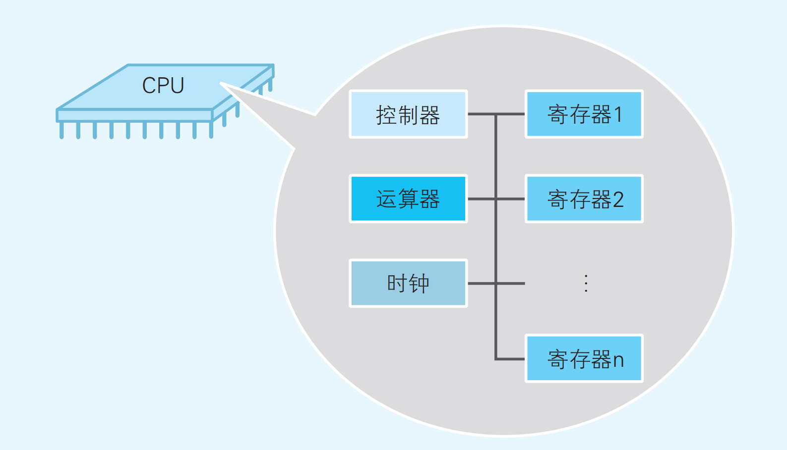

- 寄存器：用来暂存指令、 数据等处理对象  。
- 控制器：负责把内存上的指令、 数据等读入寄存器，并根据指令的执行结果来控制整个计算机。  
- 运算器：负责运算从内存读入寄存器的数据。  
- 时钟：负责发出 CPU 开始计时的时钟信号  。


#### 指令的执行

CPU通过各个组件的配合来执行一条指令：

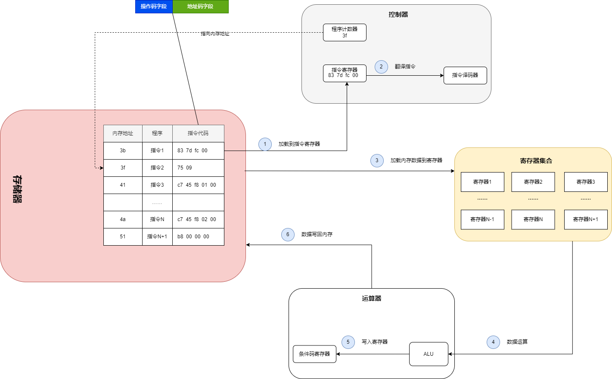


#### 程序的执行

程序是指令的集合，一个程序就是在不断的执行指令，当从内存中加载指令后，就会更新程序计数器的值到下一条指令的地址，如此循环往复，就是程序的执行


#### 从可执行文件到程序

简单可以看成三个过程：

1. 加载程序：解析可执行文件格式，加载到内存中
2. 初始化进程结构：进程的内存映射、堆栈，程序计数器（IP）等，指向程序的入口
3. 返回用户态：返回用户态时IP指向程序的入口

这样，进程就创建出来了

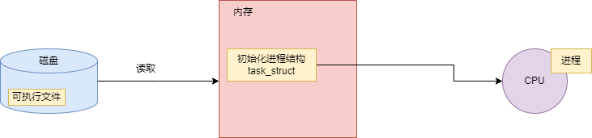

返回用户态时拿到的IP值就是程序的第一条指令命令，程序也就开始执行了。

这个指令的集合是保存在进程中的，跟进程相关联


### 进程结构

```c
struct task_struct {
    pid_t                   pid;            /* 线程ID */
    pid_t                   tgid;           /* 进程ID */

    /* 内存管理 */
    struct mm_struct        *mm;            /* 进程的内存描述符 */
    struct mm_struct        *active_mm;     /* 当前 CPU 上的内存描述符 */
    
    /* 内核栈 */
    void* stack;							/* 内核栈，进程上下文 */
	
    ……
};
```

内核栈的大小在内核的定义如下

```c
#define THREAD_SIZE_ORDER  1
#define THREAD_SIZE    (PAGE_SIZE << THREAD_SIZE_ORDER)	//PAGE_SIZE=4K
```

在Linux中有一个 union thread_union 共用体，其定义如下

```c
union thread_union {
#ifndef CONFIG_THREAD_INFO_IN_TASK
  struct thread_info thread_info;
#endif
  unsigned long stack[THREAD_SIZE/sizeof(long)];
};
```

stack表示栈空间，所以内核栈的布局是这样的

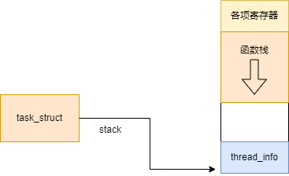

在内核栈的最高端，存放着一个 pt_regs 结构，这个结构包含了相关寄存器的定义，用户态寄存器的值就保存在这里，对于X86 32 位其定义如下

```c
struct pt_regs {
  unsigned long bx;unsigned long cx;unsigned long dx;unsigned long si;
  unsigned long di;unsigned long bp;unsigned long ax;unsigned long ds;
  unsigned long es;unsigned long fs;unsigned long gs;unsigned long orig_ax;unsigned long ip;unsigned long cs;unsigned long flags;unsigned long sp;unsigned long ss;
};
```

剩余的空间用于函数栈，向下增长


### 进程的调度

进程调度的过程大概如图：

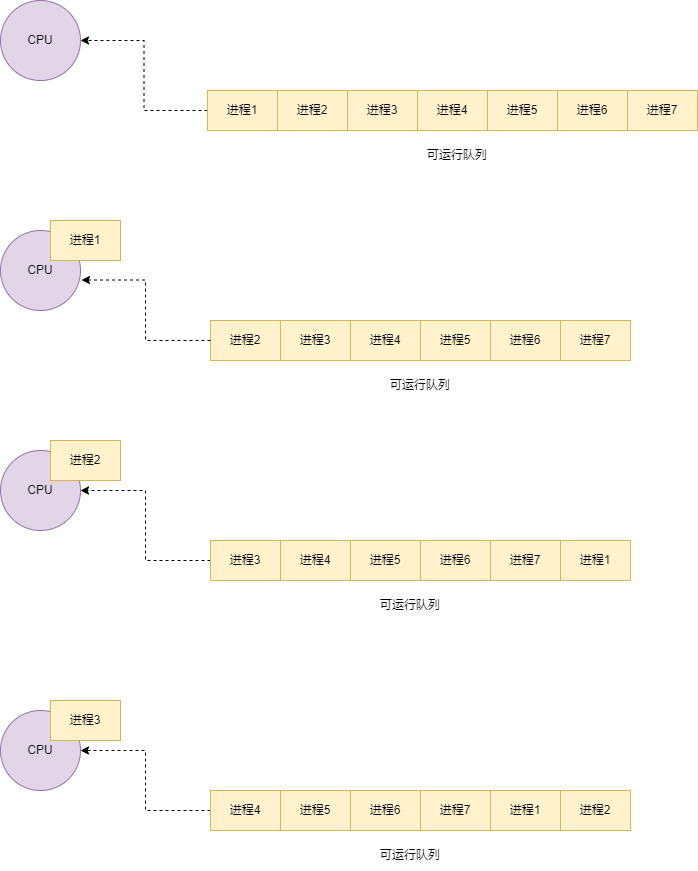


#### 调度时机

CPU不断执行当前的进程指令，所以在这种情况下，只要进程任务没结束，进程是独占整个CPU资源的。所以需要依靠其他的手段来协助调度了，也就是时钟中断，依靠硬件来实现。

### 中断

#### 中断描述符表

操作系统中注册了很多中断处理程序，中断描述符表指向了中断处理程序的地址。

在CPU内部有一个寄存器，中断描述符表寄存器，指向内存中表的初始地址和表大小。

所以，当中断发生时，我们可以通过中断描述符表寄存器找到中断处理程序。

#### 可编程中断控制器

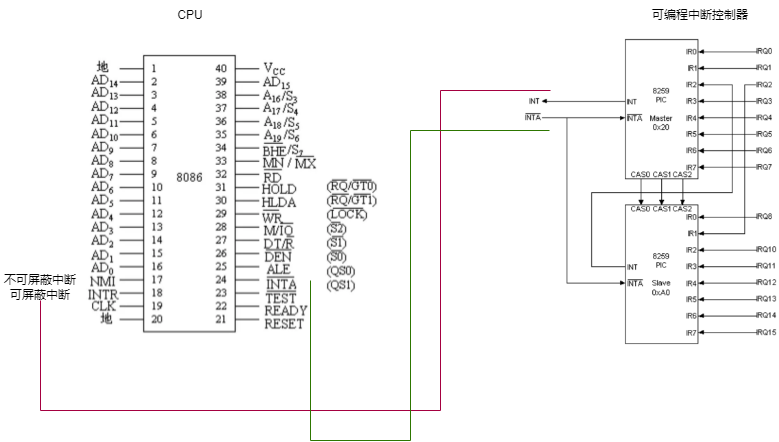

外部设备的中断对应一个中断向量号，外部设备与可编程中断控制器的IRQ接口相连接。

当外部设备产生中断时，会可编程中断控制器的IRQ接口产生信号，之前将中断信号保存在“待处理中断队列”（IRR寄存器）中，通知CPU处理中断信号。之后，CPU会向可编程中断控制器询问要处理的中断向量号，再根据中断描述符表，找到中断处理程序。

在操作系统启动时，会初始化一个中断处理程序表，对应着不同中断信号的处理程序

#### 时钟中断全流程

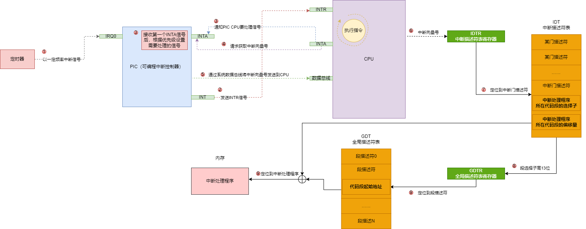

### 进程切换

在中断发生时，处理器会保存进程的上下文：

- 栈空间
- 标志寄存器eflags
- cs，ip寄存器
- 其他寄存器

将上下文保存到栈中。

之后再重新调度，拿到一个可运行进程执行，这样就完成了进程的抢占式调度。


### 小结

进程的调度是依赖时钟中断的，靠硬件来实现


## 协程

- 协程是在进程（线程）的基础上执行的，线程是依赖硬件实现抢占式调度的，协程如何执行
- 当线程发生了阻塞，依赖于线程的协程也就无法运行，如何处理


### GMP模型

G：goroutine（协程）

M：thread（线程）

P：processor（处理器）

goroutine，运行任务的载体

thread，内核线程

processor，包含了运行的goroutine资源，如果线程想运行goroutine，必须先获取P，P中还包含了可运行的G队列。

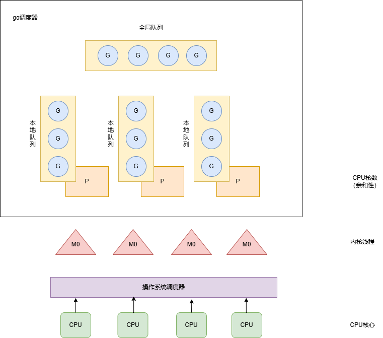

看一下正常调度的代码：

- go func创建协程

  ```go
  func newproc(fn *funcval) {
  	gp := getg()         //获取当前g
  	pc := getcallerpc()  //获取caller pc
  	systemstack(func() { //切换系统栈，在g0上执行
  		newg := newproc1(fn, gp, pc)
  		_p_ := getg().m.p.ptr()  //优先关联到父协程上的p中
  		runqput(_p_, newg, true) //将g放入到运行队列中
  		……
  	})
  }
  ```

- 创建一个g结构体

  ```go
  func newproc1(fn *funcval, callergp *g, callerpc uintptr) *g {
  	_g_ := getg()
  	……
  	_p_ := _g_.m.p.ptr() //拿到p
  	newg := gfget(_p_)   //拿一个dead G
  	if newg == nil {     //拿不到G，就分配一个
  		newg = malg(_StackMin)           //创建一个g，分配2048字节的栈
  		……
  	}
  	……
  	sp := newg.stack.hi - totalSize  //设置栈
  	……
  	newg.sched.sp = sp                                                   ……
      // 设置退出函数
  	newg.sched.pc = abi.FuncPCABI0(goexit) + sys.PCQuantum
  	newg.sched.g = guintptr(unsafe.Pointer(newg))
      //将函数的执行地址设置到sched的pc中
  	gostartcallfn(&newg.sched, fn)                                   
  	//设置父协程的相关属性
  	newg.gopc = callerpc                     //父协程pc
  	newg.ancestors = saveAncestors(callergp) //父协程
  	newg.startpc = fn.fn                     //协程任务的函数地址
  	……
  	casgstatus(newg, _Gdead, _Grunnable) //设置为可运行状态
  	……
  	return newg //返回分配的g
  }
  
  func gostartcallfn(gobuf *gobuf, fv *funcval) {
  	var fn unsafe.Pointer
  	if fv != nil {
  		fn = unsafe.Pointer(fv.fn)
  	} 
      ……
  	gostartcall(gobuf, fn, unsafe.Pointer(fv))
  }
  
  func gostartcall(buf *gobuf, fn, ctxt unsafe.Pointer) {
  	sp := buf.sp
  	sp -= goarch.PtrSize
      //设置goexit为返回地址
  	*(*uintptr)(unsafe.Pointer(sp)) = buf.pc
  	buf.sp = sp
  	buf.pc = uintptr(fn)
  	buf.ctxt = ctxt
  }
  ```

- 当前协程任务执行结束

  ```go
  TEXT runtime·goexit(SB),NOSPLIT|TOPFRAME,$0-0
  	BYTE	$0x90	// NOP
  	CALL	runtime·goexit1(SB)	// does not return
  	// traceback from goexit1 must hit code range of goexit
  	BYTE	$0x90	// NOP
  
  
  func goexit1() {
  	……
  	mcall(goexit0)	//切换到g0，并把当前协程封装成g结构，传入goexit0函数中
  }
  
  func goexit0(gp *g) {
  	_g_ := getg()
  	_p_ := _g_.m.p.ptr()
  	casgstatus(gp, _Grunning, _Gdead)
  	……
  	gfput(_p_, gp)	//放入到gFree队列中
  	……
  	schedule()	//重新调度
  }
  ```


流程图如下：

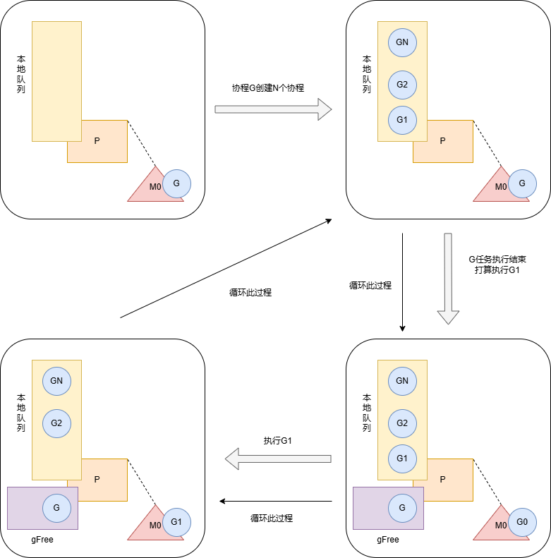


### 程序的入口

在`src/runtime/rt0_linux_amd64.s`文件中

```assembly
#include "textflag.h"

TEXT _rt0_amd64_linux(SB),NOSPLIT,$-8
	JMP	_rt0_amd64(SB)

TEXT _rt0_amd64_linux_lib(SB),NOSPLIT,$0
	JMP	_rt0_amd64_lib(SB)
```

在go程序启动时，会开启一个监控线程。

程序入口到可运行的main函数调用路径：

`_rt0_amd64_linux -> runtime.rt0_go -> runtime.newproc -> runtime.mstart -> runtime.main`。

具体实现在`runtime.main`函数中

```go
// The main goroutine.
func main() {
	g := getg()

    ……
	
	mainStarted = true //是否运行newproc开一个新线程

	if GOARCH != "wasm" { // no threads on wasm yet, so no sysmon
		systemstack(func() {
			newm(sysmon, nil, -1) //新开一个线程运行sysmon
		})
	}

	……

	//运行runtime包下的init函数
	doInit(&runtime_inittask) // Must be before defer.

	……

	//执行main包下的初始化
	doInit(&main_inittask)

	……
    
	fn := main_main
    
	//执行main函数
	fn()
    
	……

	exit(0)
	for {
		var x *int32
		*x = 0
	}
}
```

### 监控线程

- 通过clone函数来创建一个内核线程运行sysmon

  ```go
  if GOARCH != "wasm" { // no threads on wasm yet, so no sysmon
  	systemstack(func() {
  		newm(sysmon, nil, -1) //新开一个线程运行sysmon
  	})
  }
  ```

- sysmon

  ```go
  //go:nowritebarrierrec
  func sysmon() {
  	……
  	//循环中的空闲次数
  	idle := 0
  	delay := uint32(0) //启动后延迟
  	for {
  		//刚开始启动休眠20us
  		if idle == 0 {
  			delay = 20
  		} else if idle > 50 {
  			delay *= 2
  		}
  		if delay > 10*1000 {
  			delay = 10 * 1000
  		}
  		usleep(delay) //休眠
  		now := nanotime()
  		……
  		// 轮询网络，轮询时间超过10ms
  		lastpoll := int64(atomic.Load64(&sched.lastpoll))                    //查询最后一次轮询的时间
  		if netpollinited() && lastpoll != 0 && lastpoll+10*1000*1000 < now { //超过10ms，处理网络
  			//处理最后一次轮询时间
  			atomic.Cas64(&sched.lastpoll, uint64(lastpoll), uint64(now))
  			//尝试从epoll中获取处理的网络请求（封装在g list中），不阻塞
  			list := netpoll(0)
  			if !list.empty() { //有网络请求
  				incidlelocked(-1)
  				injectglist(&list) //运行一批g
  				incidlelocked(1)
  			}
  		}
  		……
  		//抢占系统调用中的p和长时间运行的g
  		if retake(now) != 0 { //发生了抢占（系统调用或者长时间运行），重新将休眠时间设置为20us
  			idle = 0
  		} else { //没发生抢占，新增空闲数，调整休眠时间
  			idle++
  		}
          ……
  	}
  }
  ```

### 抢占

- 抢占函数

  ```go
  func retake(now int64) uint32 {
  	n := 0 //处理的系统阻塞的p个数
      
  	lock(&allpLock)
      
  	for i := 0; i < len(allp); i++ {
  		_p_ := allp[i]
  		if _p_ == nil {
  			continue
  		}
  		pd := &_p_.sysmontick //p运行的最后一个滴答
  		s := _p_.status       //读取p状态
  		sysretake := false
          
          //p处理运行状态或者系统调用状态
  		if s == _Prunning || s == _Psyscall {
  			//G运行过长，则抢占
  			t := int64(_p_.schedtick)     //调度器调度次数
              //系统监控上的滴答数与p上的滴答数不相等，
              //也就是在本次监控与上一次监控之间，p上已经执行了协程的调度，
              //所以不需要抢占，只需要更新滴答信息就可以了
  			if int64(pd.schedtick) != t {
  				pd.schedtick = uint32(t)
  				pd.schedwhen = now
  				//now - pd.schedwhen >= forcePreemptNS，
                  //左表达式表示g在p未发生切换运行的时间
  				// g运行超过10ms，那么就标记为抢占
  			} else if pd.schedwhen+forcePreemptNS <= now { 
                  //监控函数运行至今，p的未进行过任何调度切换，查看g运行的时间
  				//运行时间过长，则标记需要抢占
                  //设置g和p的抢占状态，发送信号;发送信号抢占，对系统调用没用
  				preemptone(_p_)
  				sysretake = true //标记系统抢占，p会独立出来
  			}
  		}
          
          
  		if s == _Psyscall {
  			//超过1个滴答数，系统调用会被打断
  			t := int64(_p_.syscalltick)
              //没有标记为抢占，检查期间系统调用切换过，更新滴答数
  			if !sysretake && int64(pd.syscalltick) != t {
  				pd.syscalltick = uint32(t)
  				pd.syscallwhen = now
  				continue
  			}
              
  			……
              
  			//解锁
  			unlock(&allpLock)
  			
              ……
              
  			lock(&allpLock)
  		}
  	}
  	unlock(&allpLock)
  	return uint32(n)
  }
  ```
  
- 发送信号抢占

  ```go
  func preemptone(_p_ *p) bool { //某p通知另一个p
  	
      ……
      
  	gp := mp.curg
  	
      ……
  
  	gp.preempt = true //标记g需要被抢占
  	gp.stackguard0 = stackPreempt
  
  	// Request an async preemption of this P.
  	// 请求该 P 的异步抢占
  	if preemptMSupported && debug.asyncpreemptoff == 0 {
  		_p_.preempt = true
  		//向线程发送抢占信号
  		preemptM(mp)
  	}
  
  	return true
  }
  
  func preemptM(mp *m) {
  	……
  
  	if atomic.Cas(&mp.signalPending, 0, 1) { //标记为抢占
          
  		……
          
  		//向特定的线程发送一个抢占信号
  		signalM(mp, sigPreempt) //发送抢占信号，_SIGURG
  	}
  
  	……
  }
  ```


## 信号处理函数

- 执行mainPC函数

  ```assembly
  TEXT runtime·rt0_go(SB),NOSPLIT|TOPFRAME,$0
  	// copy arguments forward on an even stack
  	MOVQ	DI, AX		// argc
  	MOVQ	SI, BX		// argv
  	SUBQ	$(5*8), SP		// 3args 2auto 栈顶向下扩展40字节
  	ANDQ	$~15, SP        //SP = SP & 10000，将SP的后四位置为0，内存地址16字节对齐，后4位必须为0
  	MOVQ	AX, 24(SP)  // SP + 24 = AX（表示距SP地址24字节处，保存AX的值）
  	MOVQ	BX, 32(SP)  // SP + 32 = BX		将命令行参数保存到线程栈中
  
  	……
  
  	LEAQ	runtime·m0+m_tls(SB), DI        //DI = &m0.tls
  	CALL	runtime·settls(SB)              //m0.tls[1] = SF寄存器的基值
  
  	……
  
  	MOVL	24(SP), AX		// copy argc
  	MOVL	AX, 0(SP)
  	MOVQ	32(SP), AX		// copy argv
  	MOVQ	AX, 8(SP)
  	CALL	runtime·args(SB)
  	CALL	runtime·osinit(SB)
  	CALL	runtime·schedinit(SB)
  
  	MOVQ	$runtime·mainPC(SB), AX		// main函数在这个函数中执行
  	PUSHQ	AX
  	CALL	runtime·newproc(SB)		// go func(){} 调用的就是这个函数
  	POPQ	AX
  
  	CALL	runtime·mstart(SB)		//真正执行mainPC函数
  
  	CALL	runtime·abort(SB)	// mstart should never return
  	RET
  	
  	……
  ```

- 主流程函数执行

  ```go
  // mstart调用mstart0
  func mstart0() {
  	_g_ := getg() //从TLS获取g，这里是g0
  
  	……
      
  	mstart1()                         //在启动流程中不会退出
  
  	……
  }
  
  func mstart1() {
  	_g_ := getg()
  
  	……
      
  	_g_.sched.g = guintptr(unsafe.Pointer(_g_)) //g0.sched.g = g0
  	_g_.sched.pc = getcallerpc()                //调用者PC值
  	_g_.sched.sp = getcallersp()                //调用者SP值
  
  	……
      
  	if _g_.m == &m0 { //启动流程才会执行
  		mstartm0() //初始化信号
  	}
  
  	//正常函数启动流程不执行
  	if fn := _g_.m.mstartfn; fn != nil {
  		//对于sysmon来说，直接在这里死循环了
  		fn()
  	}
  
  	……
      
  	schedule()
  }
  ```

- 初始化信号

  ```go
  func mstartm0() {
  	……
      
  	initsig(false) //设置信号处理程序
  }
  
  func initsig(preinit bool) {
  	……
  
  	for i := uint32(0); i < _NSIG; i++ { //针对每个信号做处理
  		t := &sigtable[i]
  		if t.flags == 0 || t.flags&_SigDefault != 0 {
  			continue
  		}
  
  		……
  
  		handlingSig[i] = 1                           //标记go处理程序
  		setsig(i, abi.FuncPCABIInternal(sighandler)) //设置信号处理程序
  	}
  }
  
  func setsig(i uint32, fn uintptr) {
  	var sa sigactiont
  	sa.sa_flags = _SA_SIGINFO | _SA_ONSTACK | _SA_RESTORER | _SA_RESTART
  	sigfillset(&sa.sa_mask) //处理程序期间，对所有信号屏蔽阻塞
  	
      ……
      
  	if fn == abi.FuncPCABIInternal(sighandler) {
  		if iscgo {
  			fn = abi.FuncPCABI0(cgoSigtramp)
  		} else {
  			fn = abi.FuncPCABI0(sigtramp) //将fn替换成sigtramp
  		}
  	}
      
      ……
      
  	sa.sa_handler = fn     //设置信号处理函数
  	sigaction(i, &sa, nil) //设置信号	通过linux rt_sigaction函数设置
  }
  ```

### 信号处理函数注册

[rt_sigaction](https://www.man7.org/linux/man-pages/man2/sigaction.2.html)函数

- sigtramp函数

  ```go
  TEXT runtime·sigtramp(SB),NOSPLIT|TOPFRAME,$0
  
  	……
  
  	MOVQ	DI, AX	// sig
  	MOVQ	SI, BX	// info
  	MOVQ	DX, CX	// ctx
  	CALL	·sigtrampgo<ABIInternal>(SB)
  
  	ADJSP	$-24
  
  	POP_REGS_HOST_TO_ABI0()
  	RET
  ```

- sigtrampgo函数

  ```go
  func sigtrampgo(sig uint32, info *siginfo, ctx unsafe.Pointer) {
  	……
  	c := &sigctxt{info, ctx}
  	//获取g
  	g := sigFetchG(c)
  	//将g存入tls
  	setg(g)
  	……
  	setg(g.m.gsignal) //设置信号处理程序的g为gsignal
      ……
  	sighandler(sig, info, ctx, g)
      ……
  }
  
  
  func sighandler(sig uint32, info *siginfo, ctxt unsafe.Pointer, gp *g) {
  	_g_ := getg()
  	c := &sigctxt{info, ctxt}
  	mp := _g_.m
  	……
  	if sig == sigPreempt && debug.asyncpreemptoff == 0 && !delayedSignal {
  		//处理信号抢占
  		doSigPreempt(gp, c)
  	}
  	……
  }
  
  
  func doSigPreempt(gp *g, ctxt *sigctxt) {
  	//检查gp是否要被抢占，并且可以被安全的抢占
  	if wantAsyncPreempt(gp) {
  		//检查是否可以被安全的抢占
  		if ok, newpc := isAsyncSafePoint(gp, ctxt.sigpc(), ctxt.sigsp(), ctxt.siglr()); ok {
  			// Adjust the PC and inject a call to asyncPreempt.
  			//调整pc并调用asyncPreempt
  			//调整ip寄存器为asyncPreempt地址
  			//信号函数处理完就会执行asyncPreempt，newpc作为函数退出的地址
  			ctxt.pushCall(abi.FuncPCABI0(asyncPreempt), newpc)
  		}
  	}
  
  	……
  }
  
  // 执行targetPC，保存resumePC，以便恢复程序
  func (c *sigctxt) pushCall(targetPC, resumePC uintptr) {
  	// Make it look like we called target at resumePC.
  	sp := uintptr(c.rsp()) //拿到栈信息
  	sp -= goarch.PtrSize
      //在栈里面保存resumePC，函数的返回地址
  	*(*uintptr)(unsafe.Pointer(sp)) = resumePC
  	c.set_rsp(uint64(sp))                      //保存rsp
  	c.set_rip(uint64(targetPC))                //设置rip
  }
  ```


### 函数调用

```go
func main() {
	Add(1, 2)
}

func Add(a, b int) int {
	return a + b
}
```

汇编代码大致如下：

```assembly
main.main STEXT size=54 args=0x0 locals=0x18 funcid=0x0 align=0x0
		TEXT    main.main(SB), ABIInternal, $24-0
		MOVL    $1, AX
		MOVL    $2, BX
		CALL    main.Add(SB)
		MOVQ    16(SP), BP
		ADDQ    $24, SP
		RET
		

main.Add STEXT nosplit size=49 args=0x10 locals=0x10 funcid=0x0 align=0x0
		TEXT    main.Add(SB), NOSPLIT|ABIInternal, $16-16
		SUBQ    $16, SP
		MOVQ    BP, 8(SP)
		LEAQ    8(SP), BP
		MOVQ    AX, main.a+24(SP)
		MOVQ    BX, main.b+32(SP)
		MOVQ    $0, main.~r0(SP)
		ADDQ    BX, AX
		MOVQ    AX, main.~r0(SP)
		MOVQ    8(SP), BP
		ADDQ    $16, SP
		RET
```

- 栈帧

  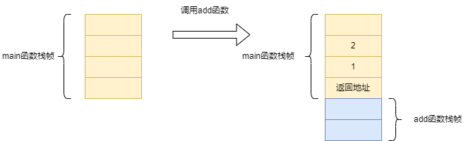

  当caller调用callee时，会把caller的返回地址压入到栈中


### 协程抢占的栈帧变化

```go
func main() {
	Func1()
}

func Func1() {
	i := 0
	for {
		i++
	}
}
```

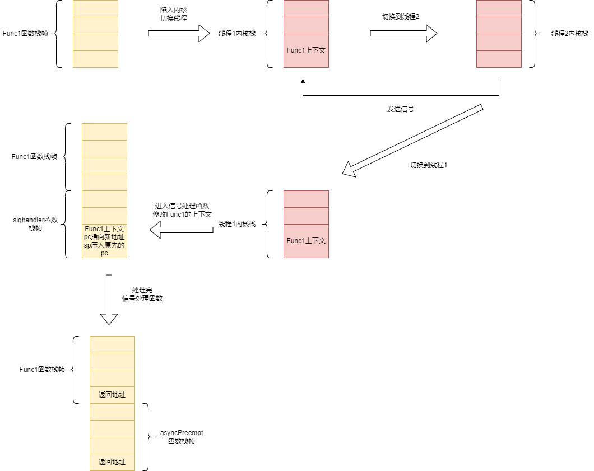

### asyncPreempt函数

```go
// asyncPreempt会调用asyncPreempt2函数
func asyncPreempt2() {
	gp := getg()
	gp.asyncSafePoint = true
	//是否要停止抢占
	if gp.preemptStop {
		mcall(preemptPark)
	} else {
        // mcall会把当前协程的上下文封装到g中，然后切换到g0去执行
		mcall(gopreempt_m) //切换到g0执行，当前g传到gopreempt_m函数参数中
	}
	gp.asyncSafePoint = false
}

func gopreempt_m(gp *g) {
	……
    
	goschedImpl(gp)
}

func goschedImpl(gp *g) {
	……
	//将gp的状态改为运行中
	casgstatus(gp, _Grunning, _Grunnable)
	//m与g解绑
	dropg()
	lock(&sched.lock)
	//将gp放入调度器的全局可运行队列
	globrunqput(gp)
	unlock(&sched.lock)

	//重新调度
	schedule()	//从GMP模型中拿出一个g来执行
}
```


### 协程是一个函数？

通过跟函数调用的栈帧变化对比，可以发现当发生抢占调度时，可以理解为某个函数A的代码执行了一部分，然后突然调用到了`asyncPreempt`函数，之后就重新调度了


