<h1 style="text-align:center;">Redis网络模型</h1>

# 基于TCP的网络编程

## 网络请求

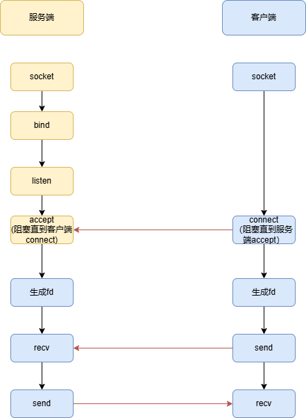

## 一次请求和响应

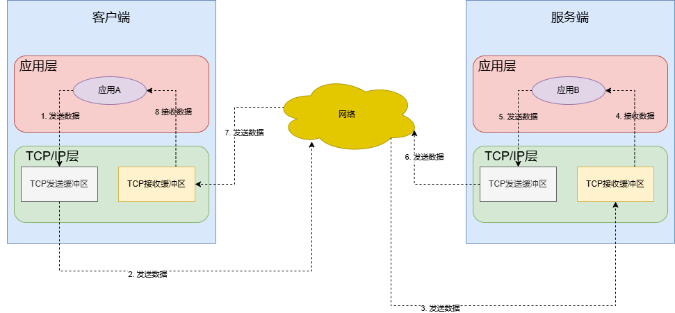

# IO模型

## IO

IO：Input/Output，指的是数据的读取（接收）或写入（发送）

## 同步IO

从服务端角度，以一次请求和响应的示例来解释不同的IO模型

上图的时序并不是固定的，有可能会先从客户端发起读请求，这时候客户端还没有数据发送过来

### 阻塞IO

1. 阻塞IO在接收缓冲区读取不到数据时，会将当前线程上下文保存在socket中，然后阻塞
2. 阻塞IO在接收缓冲区读取到数据时，会将数据拷贝到用户态空间，然后由进程去处理数据

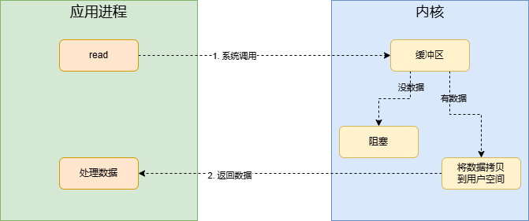

### 非阻塞IO

1. 非阻塞IO在接收缓冲区读取不到数据时，会直接返回，并告诉调用方读取不到数据(EWOULDBLOCK错误码)
2. 能读取到数据的情况跟阻塞IO是一样的

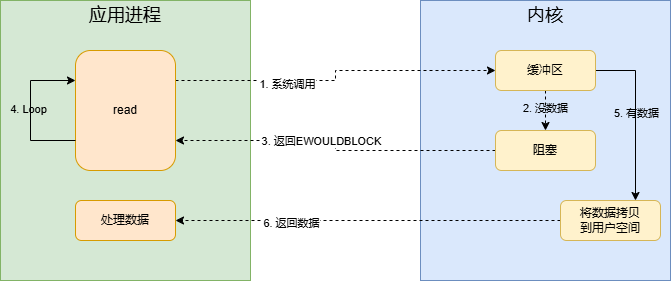

### 多路复用IO

复用的是什么？

#### 多客户端处理

从多个客户端处理来看阻塞IO和非阻塞IO

**阻塞IO**

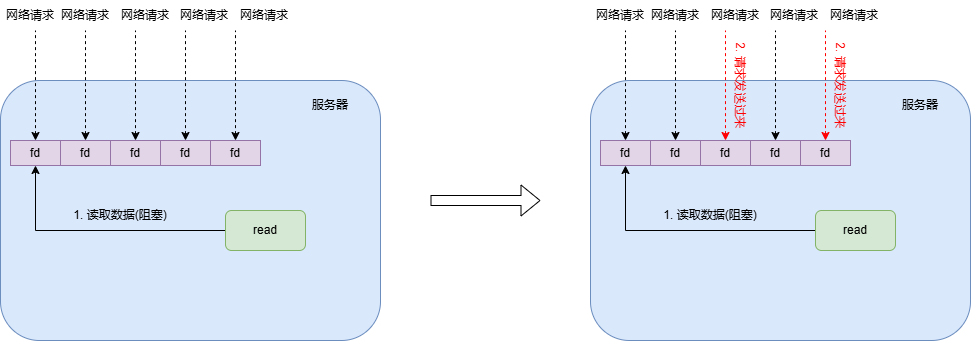

单线程模式下，对于多个网络请求，当线程在等待某个网络请求时，即时其他的网络请求到达，线程也没办法处理，阻塞直到能够处理某个网络请求，才能继续处理其他网络请求

所以在这种模式下，得用多线程来处理网络请求

**非阻塞IO**

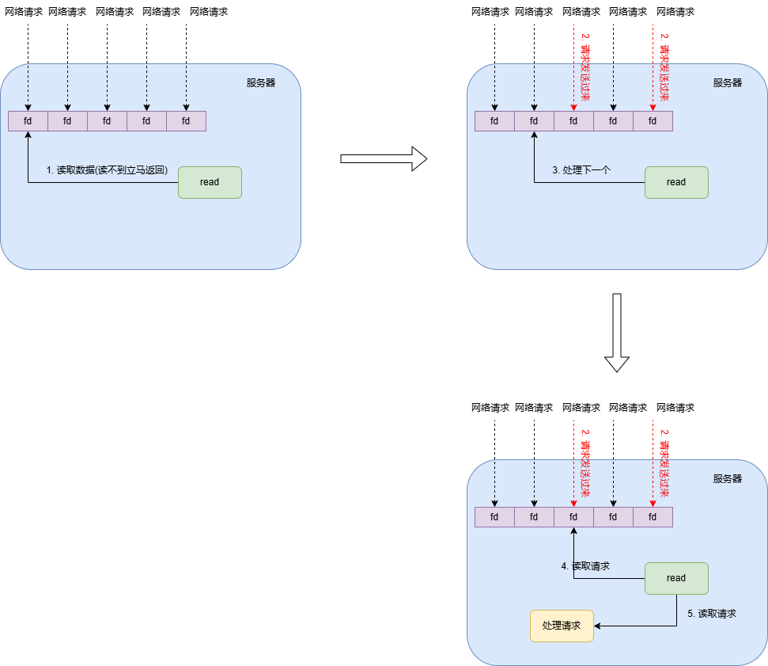


单线程模式下，处理网络请求时，如果没有请求达到，会立马返回，所以可以反复的对一组客户端网络请求进行处理。

这样会有一个问题，就是当网络请求没有数据到来时，会进行很多无效的read操作，read操作是系统调用，这是一种资源的浪费


**复用**

- 系统调用：将多次系统调用复用为1次
- 线程：将多个线程处理复用为1个
- 文件描述符：统一检测多个文件描述符的状态


#### select

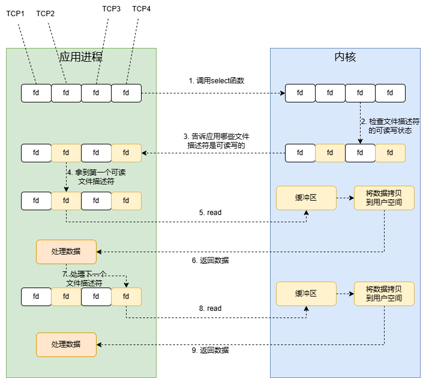

- 每次都要将一组文件描述符拷贝到内核
- 返回可读个数，还需要自己遍历，检查哪个文件是可读的

#### poll

select只能监听1024个文件描述符，poll去掉了这个限制

#### epoll

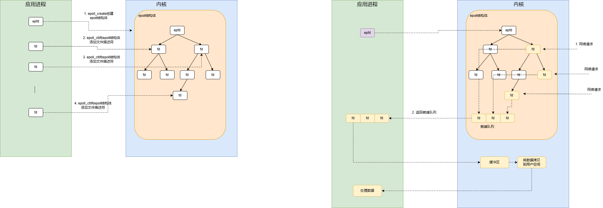

### 信号驱动IO

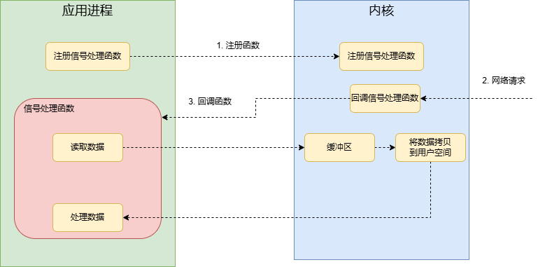

## 异步IO

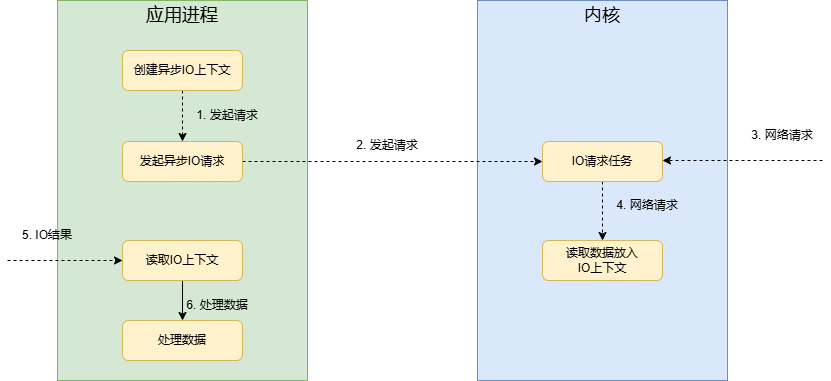


# Redis网络模型

## 处理网络请求

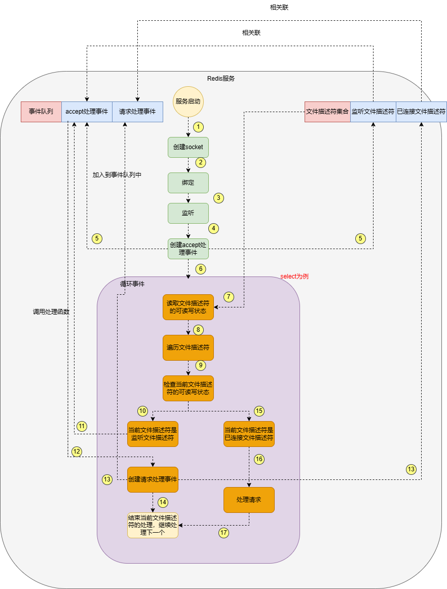

从上述的分析可以看到redis处理网络请求用的是IO多路复用

## Reactor模型

Reactor 模式是一种设计模式，常用于基于事件驱动的服务器中。它的目的是处理并发的请求，并且能够有效地将请求分配到不同的处理任务上。Reactor 模式通常与 IO 多路复用技术一起使用，以实现高效的事件驱动处理。

Reactor 模式的核心组件：

- **Reactor**：负责接收和分发事件。
- **Handler**：负责具体的事件处理。每个事件都由一个处理程序处理，例如客户端连接或数据接收等。
- **Selector**：负责监控多个 IO 通道的事件(通常使用 IO 多路复用技术)

### 单线程模型

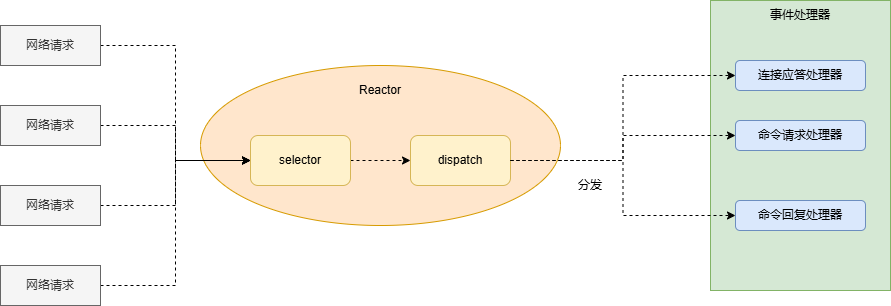

selector监控IO事件后，会通过dispatch分发到不同事件类型的处理器(函数)进行事件处理

redis对应：

- aeProcessEvents就是一个Reactor

  ```c
  void aeMain(aeEventLoop *eventLoop) {
      eventLoop->stop = 0;
      while (!eventLoop->stop) {
          aeProcessEvents(eventLoop, AE_ALL_EVENTS|
                                     AE_CALL_BEFORE_SLEEP|
                                     AE_CALL_AFTER_SLEEP);
      }
  }
  ```

- aeApiPoll就是一个selector，调用方不需要关心具体是如何实现的

  ```c
  int aeProcessEvents(aeEventLoop *eventLoop, int flags)
  {
  
          if (eventLoop->beforesleep != NULL && flags & AE_CALL_BEFORE_SLEEP)
              eventLoop->beforesleep(eventLoop);
  
          numevents = aeApiPoll(eventLoop, tvp);      
  
          if (eventLoop->aftersleep != NULL && flags & AE_CALL_AFTER_SLEEP)
              eventLoop->aftersleep(eventLoop);
      
      	……
  
      return processed;
  }
  ```

- fe->rfileProc就是一个事件处理器，aeProcessEvents会在一个for循环里进行分发

  ```c
  int aeProcessEvents(aeEventLoop *eventLoop, int flags)
  {
      	……
              
          if (eventLoop->beforesleep != NULL && flags & AE_CALL_BEFORE_SLEEP)
              eventLoop->beforesleep(eventLoop);
  
          numevents = aeApiPoll(eventLoop, tvp); 
  
          if (eventLoop->aftersleep != NULL && flags & AE_CALL_AFTER_SLEEP)
              eventLoop->aftersleep(eventLoop);
  
      	……
              
          // for循环
          for (j = 0; j < numevents; j++) {
              aeFileEvent *fe = &eventLoop->events[eventLoop->fired[j].fd];
              int mask = eventLoop->fired[j].mask;
              int fd = eventLoop->fired[j].fd;
              int fired = 0;
              
              ……
              
              if (!invert && fe->mask & mask & AE_READABLE) { //有读事件
                  fe->rfileProc(eventLoop,fd,fe->clientData,mask);
                  fired++;
                  fe = &eventLoop->events[fd];
              }
              
              ……
  
              processed++;
          }
      }
      
  	……
  
      return processed;
  }
  ```

  

[异步IO](https://zhuanlan.zhihu.com/p/364819119)
